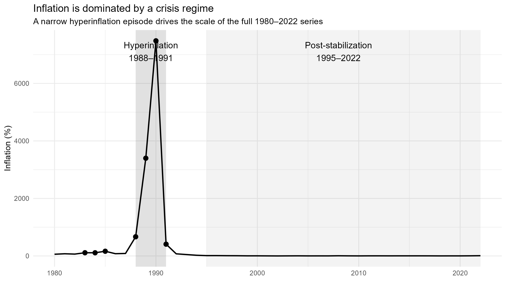
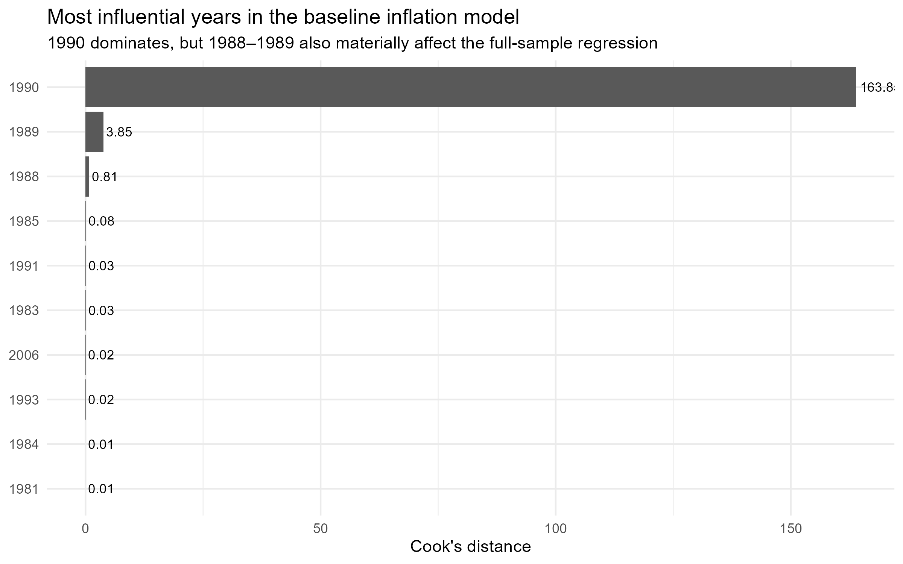
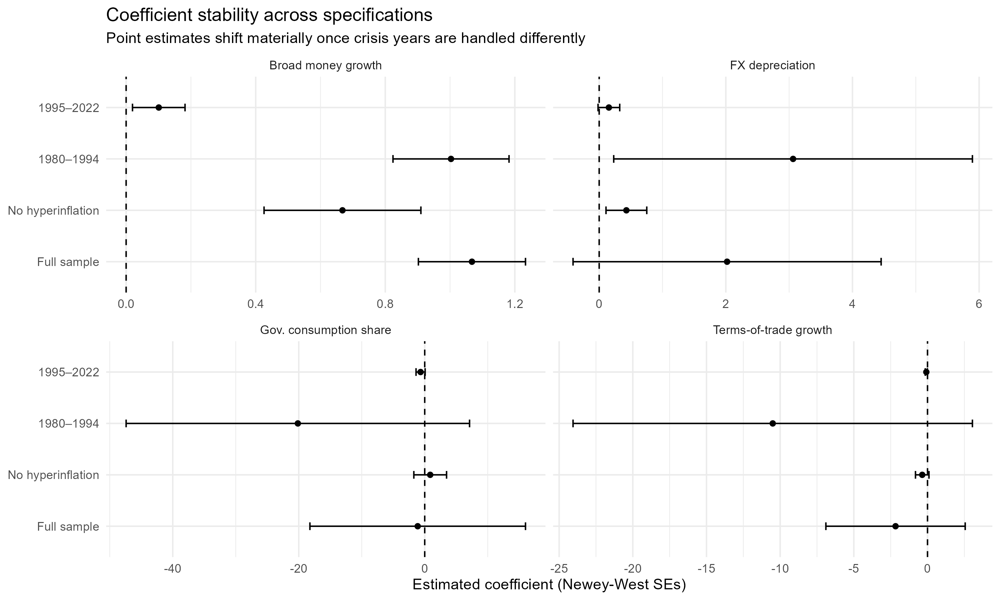
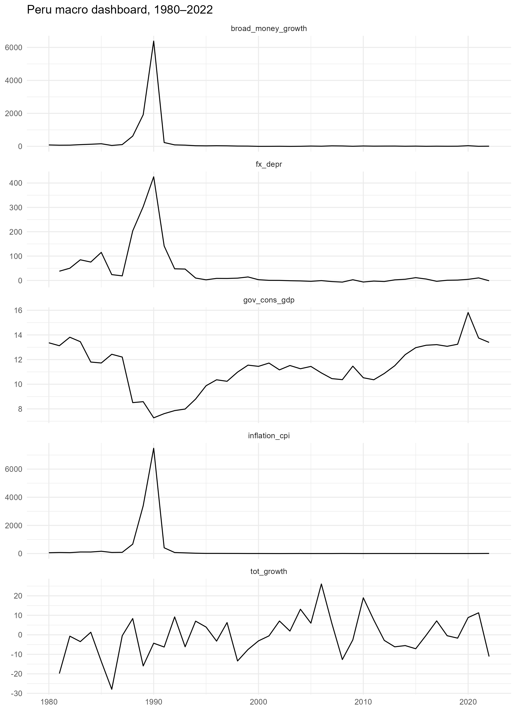
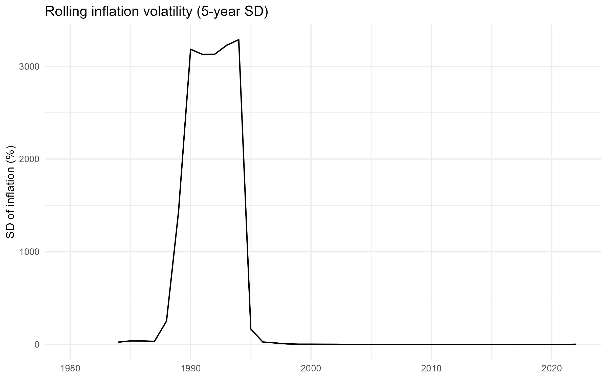
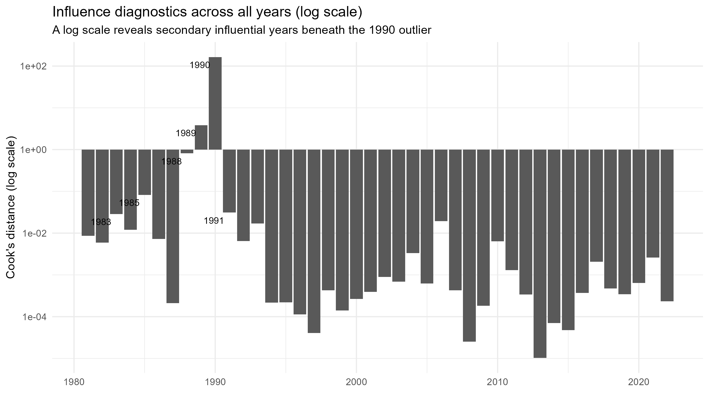
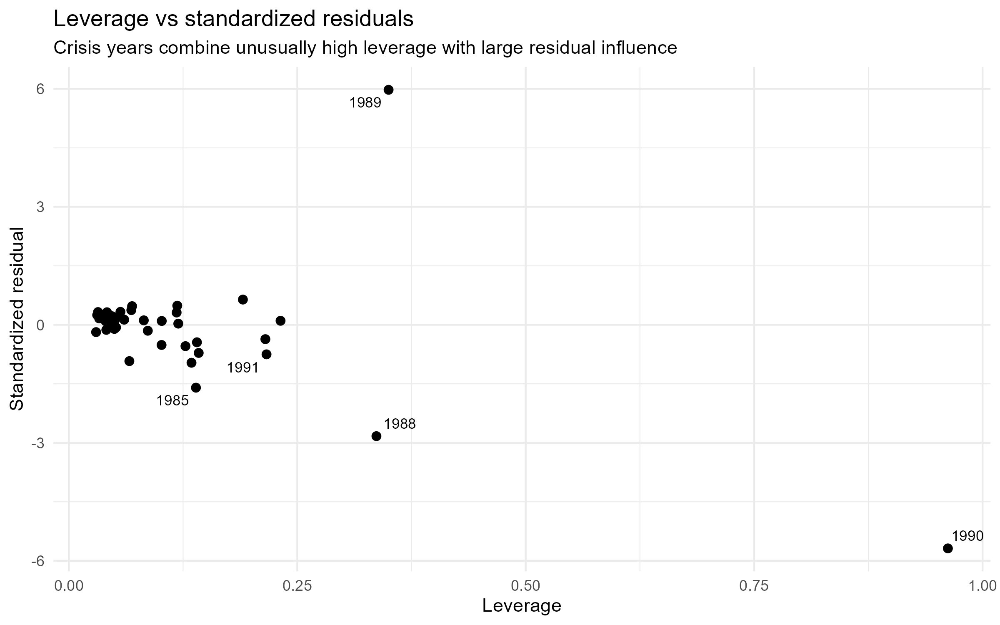
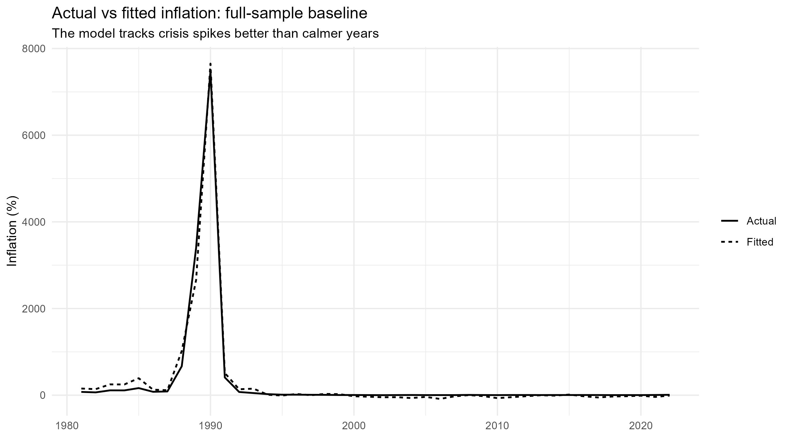

```{r setup, include=FALSE}
knitr::opts_chunk$set(
  echo = FALSE,
  warning = FALSE,
  message = FALSE,
  fig.align = "center",
  fig.pos = "H"
)

library(dplyr)
library(readr)
library(knitr)
library(kableExtra)
library(tidyr)
```

# Introduction

This project analyzes inflation dynamics in Peru from 1980 to 2022 using publicly available World Bank data. Peru’s macroeconomic history over this period is not characterized by a single stable inflation process. Instead, it includes a sharp hyperinflation episode in the late 1980s and early 1990s followed by a long period of low and relatively stable inflation after stabilization reforms.

The purpose of this project is not to estimate a causal model of inflation. Rather, it aims to answer a more practical analytical question:

**How sensitive are simple inflation models to crisis years, regime shifts, and specification choices?**

That framing matters because full-sample macro regressions can look statistically strong while being heavily driven by a few extreme observations. This report combines reproducible data collection, feature engineering, descriptive visualization, influence diagnostics, and specification comparisons to show why regime-aware analysis is necessary in small macroeconomic samples.

The dataset was built using the World Bank API through the `wbstats` R package. Annual observations were collected for Peru from 1980 to 2022.

## Core indicators

| Variable | Description |
|---|---|
| Inflation | CPI inflation (annual %) |
| Broad money growth | Broad money growth (annual %) |
| Exchange rate | Official exchange rate (LCU per USD) |
| Government consumption | Government final consumption expenditure (% GDP) |
| Terms of trade | Net barter terms of trade index |

## Engineered variables

In addition to the raw indicators, the analysis constructs:

- Exchange-rate depreciation: \(100 \times \Delta \log(\text{exchange rate})\)

- Terms-of-trade growth: \(100 \times \Delta \log(\text{terms of trade})\)

- Lagged macro variables

- Rolling inflation volatility

- Regime indicators, including a post-stabilization period and hyperinflation years

- Winsorized and transformed variants for robustness checks


# Data Quality and Coverage

The table below documents the coverage of each World Bank series used in the analysis.


```{r results='asis'}
coverage <- read.csv("output/tables/indicator_coverage.csv")

coverage_clean <- coverage %>%
  transmute(
    Indicator = indicator_name,
    `First year` = min_year,
    `Last year` = max_year,
    `Observations` = n_obs
  )

kbl(
  coverage_clean,
  format = "latex",
  booktabs = TRUE,
  caption = "Indicator coverage"
) %>%
  kable_styling(latex_options = c("hold_position", "scale_down"))
```

Because annual growth rates and lagged variables are constructed from the raw series, some model specifications use slightly fewer observations than the full 1980–2022 span. Although some source series extend beyond 2022, the analytical sample is restricted to 1980–2022 for consistency across variables and specifications.


# Analytical Approach

The project follows a descriptive, regime-aware workflow:

1. Build a reproducible macroeconomic panel from World Bank data.

2. Visualize the inflation series and identify the crisis regime.

3. Estimate a baseline full-sample model.

4. Audit whether a small number of years dominate the regression.

5. Compare coefficients across alternative samples and specifications.

6. Interpret results as descriptive associations rather than stable structural parameters.

This approach is more appropriate than relying on a single regression because Peru’s inflation history includes an extreme structural break.

# Inflation Regimes

```{r infl-regime, out.width="78%", fig.cap="Inflation is dominated by a crisis regime"}

```


Figure \@ref(fig:infl-regime) shows the central fact of the project: the full inflation series is dominated by a narrow hyperinflation episode between 1988 and 1991. The inflation spike around 1990 is so large that it determines the visual scale of the entire 1980–2022 sample.

This matters analytically because any full-sample regression is likely to be influenced heavily by these crisis years. It also suggests that Peru’s inflation dynamics are better understood as a combination of at least two regimes:

- a crisis regime in the late 1980s and early 1990s

- a post-stabilization regime beginning in the mid-1990s

# Summary Statistics

To show how strongly the crisis period affects the data, the table below reports summary statistics for the full sample and for a restricted sample excluding hyperinflation years.


```{r results='asis'}
panel <- read_csv("output/tables/panel_feat.csv", show_col_types = FALSE)

make_summary_table <- function(data, vars_map) {
  bind_rows(lapply(names(vars_map), function(v) {
    tibble(
      Variable = vars_map[[v]],
      N = sum(!is.na(data[[v]])),
      Mean = mean(data[[v]], na.rm = TRUE),
      SD = sd(data[[v]], na.rm = TRUE),
      Min = min(data[[v]], na.rm = TRUE),
      Max = max(data[[v]], na.rm = TRUE)
    )
  }))
}

vars_map <- c(
  inflation_cpi = "Inflation (CPI, %)",
  broad_money_growth = "Broad money growth (%)",
  fx_depr = "FX depreciation (%)",
  tot_growth = "Terms-of-trade growth (%)",
  gov_cons_gdp = "Government consumption (% GDP)"
)

summary_full <- make_summary_table(panel, vars_map)
summary_noncrisis <- make_summary_table(panel %>% filter(inflation_cpi < 100), vars_map)

kbl(summary_full, format = "latex", booktabs = TRUE, digits = 2,
    caption = "Panel A. Full sample summary statistics") %>%
  kable_styling(latex_options = c("hold_position", "scale_down"))
```


```{r}
kbl(summary_noncrisis, format = "latex", booktabs = TRUE, digits = 2,
    caption = "Panel B. Non-hyperinflation summary statistics") %>%
  kable_styling(latex_options = c("hold_position", "scale_down"))

```

The contrast between the two panels is large. Full-sample moments are heavily distorted by the hyperinflation years, while the restricted sample provides a much better picture of typical macroeconomic variation.


# Baseline Model

The baseline specification is a simple descriptive model:

$$
Inflation_t = \beta_0 + \beta_1 MoneyGrowth_t + \beta_2 FXDepreciation_t + \beta_3 ToTGrowth_t + \beta_4 GovConsumption_t + \epsilon_t
$$

This equation is useful as a starting point, but it should not be interpreted as a structural model of inflation. In a small annual dataset with a major crisis episode, high in-sample fit can be misleading unless the model is checked for influence and stability.


# Influence Diagnostics

```{r cooks-main, out.width="78%", fig.cap="Most influential years in the baseline inflation model"}

```

Figure \@ref(fig:cooks-main) shows that the baseline regression is dominated by a small number of years, especially 1990. That single observation is vastly more influential than the rest of the sample, while 1988 and 1989 also contribute meaningfully.

This result shows that the baseline full-sample regression is not a stable summary of the period. Rather than reflecting a relationship that holds uniformly across 1980–2022, the model is disproportionately shaped by a few crisis-era observations.


# Top influential years


```{r results='asis'}
top_influence <- read.csv("output/tables/top_influential_years.csv")

kbl(
  top_influence,
  format = "latex",
  booktabs = TRUE,
  digits = 3,
  caption = "Top influential years in the full-sample baseline model"
) %>%
  kable_styling(latex_options = c("hold_position", "scale_down"))
```

The table confirms that 1990 is an extreme leverage point in the regression. This supports the interpretation that naive full-sample OLS is fragile in this setting.


# Specification Comparison

To assess whether the main relationships are stable, the project compares coefficients across four versions of the model:

- Full sample

- Full sample excluding hyperinflation years

- Pre-stabilization sample (1980–1994)

- Post-stabilization sample (1995–2022)

All comparisons below use Newey–West standard errors to make inference more appropriate for annual time-series data.


```{r coef-stability, out.width="90%", fig.cap="Coefficient stability across specifications"}

```

Figure \@ref(fig:coef-stability) shows that coefficient magnitudes change materially across specifications.

Three patterns stand out:

1. Broad money growth remains positively associated with inflation in all four models, but the magnitude declines sharply in the post-stabilization period.

2. Exchange-rate depreciation follows a similar pattern: it is much more strongly associated with inflation in crisis-sensitive specifications than in the post-1995 sample.

3. Terms-of-trade growth and government consumption appear less stable and are estimated much less precisely.

This is the core analytical takeaway of the project. The sign pattern for money growth and exchange-rate depreciation is fairly persistent, but the magnitude of the relationship is regime-dependent.


# Model Fit Statistics

```{r results='asis'}
fit_stats <- read.csv("output/tables/model_fit_stats.csv")

kbl(
  fit_stats,
  format = "latex",
  booktabs = TRUE,
  digits = 3,
  caption = "Model fit statistics across specifications"
) %>%
  kable_styling(latex_options = c("hold_position", "scale_down"))
```

The fit statistics reinforce the same point. \(R^2\) remains very high in crisis-sensitive specifications, including the full-sample model, but falls materially in the post-stabilization sample. This suggests that the strong fit of the full-sample regression partly reflects the influence of crisis-era extremes rather than a stable inflation relationship across the entire 1980–2022 period.

The post-stabilization sample is especially informative: inflation is much lower and less volatile, and the same linear predictors explain a smaller share of variation. This suggests that the inflation process after stabilization differs meaningfully from the one observed during the crisis era.


# Interaction Model

As an additional robustness check, the project estimates an interaction model that allows the slopes on money growth and exchange-rate depreciation to differ after stabilization.


```{r results='asis'}
interaction_terms <- read.csv("output/tables/interaction_model_neweywest.csv")

interaction_clean <- interaction_terms %>%
  transmute(
    Term = term,
    Estimate = round(estimate, 3),
    `Std. Error` = round(std.error, 3),
    Statistic = round(statistic, 3),
    `p-value` = signif(p.value, 3),
    `CI low` = round(conf_low, 3),
    `CI high` = round(conf_high, 3)
  )

kbl(
  interaction_clean,
  format = "latex",
  booktabs = TRUE,
  caption = "Interaction model with Newey–West standard errors"
) %>%
  kable_styling(latex_options = c("hold_position", "scale_down"))
```

The interaction model supports the same interpretation as the split-sample results: the association between inflation and broad money growth is much stronger before stabilization than after it. Exchange-rate effects also appear to weaken materially in the post-stabilization period, although these estimates are noisier and should be interpreted cautiously.


# Main Findings
This project produces four main findings.

## 1. Peru’s inflation history is not well described by a single stable regime

The 1988–1991 hyperinflation episode dominates the scale of the full sample and fundamentally changes how full-period regressions behave.

## 2. Full-sample OLS is highly sensitive to crisis years

Influence diagnostics show that the baseline model is driven disproportionately by 1990, with 1988 and 1989 also exerting meaningful leverage.

## 3. Broad money growth and exchange-rate depreciation are the most consistent correlates of inflation

These two variables remain positively associated with inflation across several specifications, but the estimated magnitudes shrink sharply once crisis years are excluded or the analysis is restricted to the post-stabilization period.

## 4. High fit does not imply stable inference

The full-sample model produces very high in-sample fit, but specification comparisons show that the apparent strength of the model is partly a consequence of crisis-era observations.

# Limitations

This project is intentionally descriptive and has several limitations.

- The sample is small and annual, which limits statistical power.

- The pre-stabilization subsample is especially short.

- The analysis does not identify causal effects.

- Important omitted variables may still matter.

- Annual World Bank indicators cannot capture within-year crisis dynamics.

These limitations do not invalidate the project, but they do shape its interpretation. The contribution here is not causal identification. It is the careful auditing of model sensitivity in a historically unstable macroeconomic series.

# Conclusion

This project began as a standard macroeconomic regression exercise, but the final analysis shows why that framing is too simplistic for Peru’s inflation history.

A small number of crisis years dominate the full sample, strongly influence baseline regression estimates, and inflate the apparent explanatory power of naive OLS. Once those years are isolated, excluded, or modeled separately, coefficient magnitudes shift materially. Broad money growth and exchange-rate depreciation remain the strongest descriptive correlates of inflation, but their relationship with inflation is much weaker in the post-stabilization era than in the crisis regime.

This case study shows how a simple regression can become misleading in a regime-changing macro series.:

- build a reproducible data pipeline from public APIs

- engineer macroeconomic features

- identify structural breaks

- compare specifications rather than relying on a single model

- communicate model limitations clearly

That is ultimately the main analytical lesson of the project: in unstable macroeconomic data, the main lesson is that a high-fit regression can be misleading when a few crisis years dominate the sample.

# Reproducibility

All data were downloaded from the World Bank API using R.  
All figures, tables, and model outputs were generated through a reproducible script-based workflow.

The full repository includes:

- data download and cleaning

- feature engineering

- model estimation

- robustness checks

- figure and table generation

# Appendix

# Appendix A. Macroeconomic dashboard

```{r app-dashboard, echo=FALSE, out.width="75%", fig.align="center", fig.cap="Macroeconomic dashboard for Peru, 1980–2022"}

```

This dashboard provides broader macroeconomic context for the period under study. It is useful descriptively, but the main report emphasizes the inflation regime chart because it communicates the structural-break problem more directly.

# Appendix B. Rolling inflation volatility

```{r echo=FALSE, out.width="75%", fig.align="center"}

```

This figure complements the regime chart by showing how inflation volatility collapses after stabilization. It reinforces the interpretation that Peru’s macroeconomic environment became much more stable after the crisis era.

# Appendix C. Full-sample influence diagnostics (log scale)

```{r echo=FALSE, out.width="75%", fig.align="center"}

```

The main report uses the top-10 influential-years chart for readability. This log-scale figure provides a fuller diagnostic view of the influence distribution across all years.

# Appendix D. Leverage and standardized residuals

```{r echo=FALSE, out.width="75%", fig.align="center"}

```

This diagnostic plot shows that crisis years combine unusually high leverage with large residual influence, reinforcing the conclusion that the baseline full-sample regression is not a stable summary of the period.

# Appendix E. Actual versus fitted inflation

```{r echo=FALSE, out.width="75%", fig.align="center"}

```

This figure shows that the baseline model tracks crisis spikes much more closely than calmer post-stabilization years. It is therefore better read as a descriptive fit to crisis-era variation than as evidence of a stable inflation equation.


