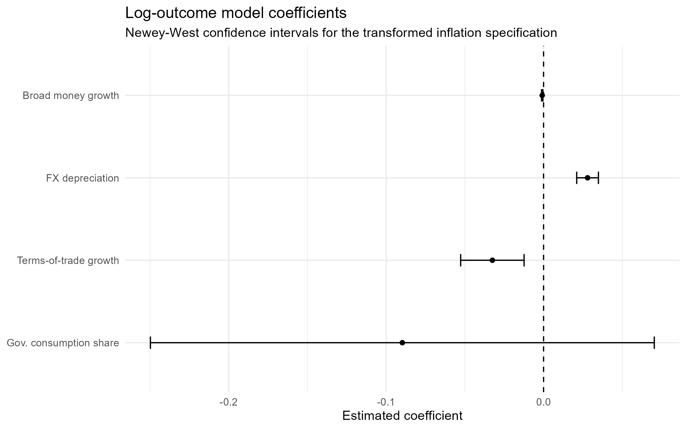
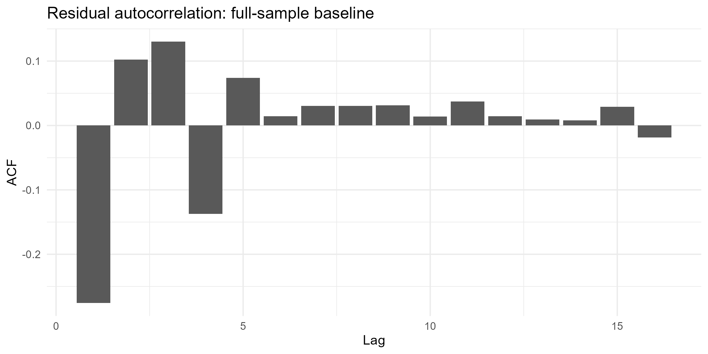

```{r setup, include=FALSE}
knitr::opts_chunk$set(
  echo = FALSE,
  warning = FALSE,
  message = FALSE,
  fig.align = "center",
  fig.pos = "H"
)

library(dplyr)
library(readr)
library(knitr)
library(kableExtra)
library(tidyr)
```

# Executive Summary

This project audits a simple annual inflation model for Peru using publicly available World Bank data from 1980 to 2022. The goal is not to estimate a causal macroeconomic model. The goal is to answer a practical analytics question:

> **How much can a model with excellent in-sample fit be distorted by outliers, regime shifts, and specification choices?**

The answer is: a lot.

A full-sample regression appears statistically strong, but that strength is heavily driven by a small number of crisis-era observations, especially the hyperinflation years around 1988–1991. Once those years are isolated, excluded, or down-weighted through alternative specifications, coefficient magnitudes change materially and model fit falls sharply. The most stable descriptive correlate across specifications is exchange-rate depreciation, while the estimated role of broad money growth is more sensitive to the sample and functional form.

## Why this matters for analytics

This is not just a macroeconomics story. It is a model-auditing story.

Analysts often see a high $R^2$, a clean regression table, and a persuasive chart and conclude that the model is reliable. This project shows why that can be misleading in small samples with extreme observations. A model can look excellent on paper while actually being dominated by a few influential rows.

## Main Takeaways

- The inflation series is dominated by a crisis regime, so a single full-sample model is not a stable summary of the entire period.

- The baseline OLS model is highly sensitive to influential observations, especially 1990.

- Exchange-rate depreciation is the most stable descriptive correlate across specifications.

- Broad money growth matters in levels-based comparisons, but its role becomes less straightforward once crisis-era scale is reduced.

- The main lesson is analytical rather than causal: strong fit should be audited, not trusted automatically.

# Project Framing

## Analytical Question

Peru’s inflation history from 1980 to 2022 is not characterized by one stable regime. It includes a severe hyperinflation episode in the late 1980s and early 1990s, followed by a much calmer post-stabilization period. That historical pattern creates a useful setting for a data analysis project focused on model robustness.

This report asks a practical portfolio-style question:

> When annual macro data contain extreme crisis years, how much can a simple regression overstate stability and explanatory power?

## What this project is and is not

This project is:

- a reproducible analytical workflow,

- a descriptive model audit,

- a regime-aware comparison of specifications,

- an example of influence diagnostics and robustness checking.

This project is not:

- a causal identification exercise,

- a forecasting model,

- a full dynamic time-series study,

- a claim that one regression uncovers Peru’s inflation process.

That framing is intentional. The value of the project is in showing how to challenge a good-looking model before trusting it.

# Data and Reproducibility

## Data Source

The dataset was built from publicly available World Bank indicators using the `wbstats` package in R. Annual observations were collected for Peru from `r params$start_year` to `r params$end_year`.

## Variables used

The core variables are:

- Inflation, consumer prices (annual %)

- Broad money growth (annual %)

- Official exchange rate (used to construct FX depreciation)

- General government final consumption expenditure (% of GDP)

- Net barter terms of trade index

Feature engineering includes:

- annual log-difference style transformations where appropriate,

- FX depreciation,

- growth rates,

- lagged values for a supporting auxiliary model,

- transformed and winsorized outcomes for robustness checks,

- a post-stabilization regime indicator.


## Indicator coverage


```{r results='asis'}
coverage <- read.csv("output/tables/indicator_coverage.csv")

coverage_clean <- coverage %>%
  transmute(
    Indicator = indicator_name,
    `First year` = min_year,
    `Last year` = max_year,
    `Observations` = n_obs
  )

kbl(
  coverage_clean,
  format = "latex",
  booktabs = TRUE,
  caption = "Indicator coverage"
) %>%
  kable_styling(latex_options = c("hold_position", "scale_down"))
```

Although some raw series extend beyond 2022, the analytical sample is restricted to 1980–2022 for consistency across variables and specifications.

## Reproducible workflow

The workflow is intentionally simple and auditable:

1. Pull data from a public API.

2. Clean and align annual indicators.

3. Construct derived variables.

4. Visualize the inflation series.

5. Fit a baseline model.

6. Audit influence and leverage.

7. Compare results across alternative specifications.

8. Summarize what changes and why.

# Why the full sample is misleading

## Inflation regime chart

```{r infl-regime, out.width="78%", fig.cap="Inflation is dominated by a crisis regime"}
knitr::include_graphics("output/figures/02_inflation_regime_chart.png")
```


The central fact of the project is visual, not econometric. Inflation is dominated by a narrow hyperinflation episode between 1988 and 1991. The spike around 1990 is so extreme that it determines the scale of the entire chart.

That matters because a full-sample regression will naturally be pulled toward the years with the largest values. In practical analytics terms, this means a small number of observations can make a model look much more stable and much more accurate than it really is for the typical year.

## Summary statistics

To show how strongly the crisis period affects the data, the table below reports summary statistics for the full sample and for a restricted sample excluding hyperinflation years.


```{r results='asis'}
panel <- read_csv("output/tables/panel_feat.csv", show_col_types = FALSE)

make_summary_table <- function(data, vars_map) {
  bind_rows(lapply(names(vars_map), function(v) {
    tibble(
      Variable = vars_map[[v]],
      N = sum(!is.na(data[[v]])),
      Mean = mean(data[[v]], na.rm = TRUE),
      SD = sd(data[[v]], na.rm = TRUE),
      Min = min(data[[v]], na.rm = TRUE),
      Max = max(data[[v]], na.rm = TRUE)
    )
  }))
}

vars_map <- c(
  inflation_cpi = "Inflation (CPI, %)",
  broad_money_growth = "Broad money growth (%)",
  fx_depr = "FX depreciation (%)",
  tot_growth = "Terms-of-trade growth (%)",
  gov_cons_gdp = "Government consumption (% GDP)"
)

summary_full <- make_summary_table(panel, vars_map)
summary_noncrisis <- make_summary_table(panel %>% filter(inflation_cpi < 100), vars_map)

kbl(summary_full, format = "latex", booktabs = TRUE, digits = 2,
    caption = "Panel A. Full sample summary statistics") %>%
  kable_styling(latex_options = c("hold_position", "scale_down"))
```


```{r}
kbl(summary_noncrisis, format = "latex", booktabs = TRUE, digits = 2,
    caption = "Panel B. Non-hyperinflation summary statistics") %>%
  kable_styling(latex_options = c("hold_position", "scale_down"))

```

The contrast between the two panels shows why the full sample should not be treated casually. Crisis-era values stretch the distribution so much that full-sample moments say more about rare extremes than about typical variation.


# Baseline model as a diagnostic benchmark

## Baseline specification

The starting model is:

$$
Inflation_t = \beta_0 + \beta_1 MoneyGrowth_t + \beta_2 FXDepreciation_t + \beta_3 ToTGrowth_t + \beta_4 GovConsumption_t + \epsilon_t
$$

This is useful as a benchmark, but it is not the preferred final model. In this project, the baseline regression is best understood as a diagnostic benchmark designed to answer one question: what happens when we fit a simple model across a period that clearly contains more than one regime?

## Why keep the baseline

The baseline model stays in the report because it is the clearest way to show three things:

- how a very high-fit model can still be fragile,

- how crisis years dominate coefficient estimates,

- why alternative specifications are necessary.


# Influence audit

## Most influential years

```{r cooks-main, out.width="78%", fig.cap="Most influential years in the baseline inflation model"}
knitr::include_graphics("output/figures/08_cooks_distance_top10.png")
```

```{r results='asis'}
top_influence <- read.csv("output/tables/top_influential_years.csv")

kbl(
  top_influence,
  format = "latex",
  booktabs = TRUE,
  digits = 3,
  caption = "Top influential years in the full-sample baseline model"
) %>%
  kable_styling(latex_options = c("hold_position", "scale_down"))
```

The influence results are the strongest evidence in the report. They show that the full-sample regression is not being summarized by many moderately informative observations. It is being shaped disproportionately by a tiny number of crisis-era years, especially 1990.

This is the key audit result: the model looks strong partly because a few rows carry too much weight.

# Specification Comparison

## Why compare specifications

Once it is clear that the full-sample regression is influence-heavy, the next step is not to throw away modeling. The next step is to ask whether the main relationships survive under more reasonable views of the data.

The report compares several versions of the model:

- full sample in levels,

- full sample excluding hyperinflation years,

- pre-1995 sample,

- post-1995 sample,

- interaction model,

- transformed-outcome model,

- winsorized outcome,

- supporting lagged annual model.


## Coefficient stability


```{r coef-stability, out.width="90%", fig.cap="Coefficient stability across specifications"}
knitr::include_graphics("output/figures/12_coefficient_stability.png")
```

The comparison delivers a simple message. Signs are more stable than magnitudes. Broad money growth and exchange-rate depreciation tend to point in the expected direction in the main levels-based comparisons, but the size of those relationships changes materially across regimes.

That matters because many real-world analytics mistakes come from treating “same sign” as “same model.” This project shows that the same qualitative story can mask very different quantitative relationships.


## Model fit statistics

```{r results='asis'}
fit_stats <- read.csv("output/tables/model_fit_stats.csv")

kbl(
  fit_stats,
  format = "latex",
  booktabs = TRUE,
  digits = 3,
  caption = "Model fit statistics across specifications"
) %>%
  kable_styling(latex_options = c("hold_position", "scale_down"))
```

The near-perfect $R^2$ in the full-sample levels model is the most seductive number in the report and also the most misleading. A high fit statistic is perfectly compatible with a model that is unstable, influence-heavy, and overly dependent on crisis-era scale.

The post-stabilization sample is especially informative. Once inflation becomes much lower and less volatile, the same predictors explain far less variation. That does not weaken the project. It strengthens the central point: full-sample fit was overstating stability.

# Functional form matters

## Why include a transformed-outcome model

The transformed-outcome model is not included as a box-checking robustness exercise. It is included because the data span values from near zero to several thousand percent. In that setting, a log-style transformation helps answer a more practical question:

> What do the relationships look like once the crisis spike stops dictating the scale of everything?

## Transformed-outcome coefficients

```{r log-outcome-fig, out.width="82%", fig.cap="Log-outcome model coefficients"}

```


```{r results='asis'}
log_terms <- read.csv("output/tables/log_outcome_model_neweywest.csv")

log_clean <- log_terms %>%
  transmute(
    Term = term,
    Estimate = round(estimate, 3),
    `Std. Error` = round(std.error, 3),
    Statistic = round(statistic, 3),
    `p-value` = signif(p.value, 3),
    `CI low` = round(conf_low, 3),
    `CI high` = round(conf_high, 3)
  )

kbl(
  log_clean,
  format = "latex",
  booktabs = TRUE,
  caption = "Transformed-outcome model with Newey–West standard errors"
) %>%
  kable_styling(latex_options = c("hold_position", "scale_down"))
```

The transformed specification keeps part of the original story, especially the role of exchange-rate depreciation, but it also shows that some coefficients are sensitive to functional form. That is exactly why this section matters.

For portfolio purposes, this is one of the most valuable lessons in the report: changing the scale of the outcome changes the interpretation of the model. That is not a nuisance. That is analytical information.


# What the project demonstrates

## Practical analytics lessons

```{r so-what-table, results='asis'}
so_what <- tibble::tribble(
  ~Finding, ~Risk_if_ignored, ~Better_practice,
  "Full-sample R² is extremely high", "False confidence in a fragile model", "Check influence and compare specifications",
  "1990 dominates the regression", "A few rows drive the story", "Use Cook's distance and leverage diagnostics",
  "Results shift across regimes", "One model is treated as universally valid", "Split samples or add regime-aware comparisons",
  "Functional form changes interpretation", "Coefficient story looks more stable than it is", "Audit transformed outcomes and robustness variants"
)

kable(
  so_what,
  caption = "Why the project matters beyond this dataset",
  booktabs = TRUE,
  linesep = ""
) %>%
  kable_styling(full_width = FALSE, font_size = 9) %>%
  column_spec(1, width = "3cm") %>%
  column_spec(2, width = "5cm") %>%
  column_spec(3, width = "5cm")
```

This project demonstrates five things that are directly relevant to data analyst work:

1. Building a reproducible pipeline from public data.

2. Translating a domain question into a testable analytical workflow.

3. Using visualization to detect structural problems before modeling.

4. Auditing a strong-looking model with influence and robustness checks.

5. Communicating limitations without weakening the value of the analysis.


## Hiring-manager version of the takeaway

A concise way to describe this project is:

> I built a reproducible model-audit case study showing how outliers, regime shifts, and specification choices can make a simple regression look stronger and more stable than it really is.

That framing is more useful for analytics hiring than describing the project only as a macro report.

# Limitations

This project remains intentionally narrow.

- The data are annual, so the sample is small.

- The analysis is descriptive rather than causal.

- Newey–West standard errors and residual checks make the inference more time-series aware, but they do not turn this into a full dynamic time-series study.

- Some variables are proxies rather than direct structural measures.

- The report prioritizes model sensitivity and auditability over theoretical completeness.

Those limitations do not undermine the project. They define the scope correctly.

# Conclusion

This project started as a standard regression exercise and ended as a stronger analytics story.

A naive full-sample model appears to explain inflation extremely well. But once the data are visualized, audited, and re-estimated across alternative specifications, it becomes clear that the result is not a stable summary of the whole period. Crisis-era observations, especially around 1990, dominate the model and inflate the apparent explanatory power of baseline OLS.

That is the core contribution of the report. It shows that good analysis does not end when a model fits well. It starts when the analyst asks whether the fit is trustworthy.


# Appendix

# Appendix A. Macroeconomic dashboard

```{r app-dashboard, echo=FALSE, out.width="75%", fig.align="center", fig.cap="Macroeconomic dashboard for Peru, 1980–2022"}
knitr::include_graphics("output/figures/01_dashboard_timeseries.png")
```

This dashboard provides useful context, but the main report keeps the regime chart as the anchor figure because it communicates the structural-break problem more directly.

# Appendix B. Rolling inflation volatility

```{r echo=FALSE, out.width="75%", fig.align="center", fig.cap="Rolling inflation volatility"}
knitr::include_graphics("output/figures/06_rolling_inflation_volatility.png")
```


# Appendix C. Full influence distribution

```{r echo=FALSE, out.width="75%", fig.align="center" ,fig.cap="Full-sample influence diagnostics (log scale)"}
knitr::include_graphics("output/figures/08b_cooks_distance_logscale.png")
```


# Appendix D. Leverage and standardized residuals

```{r echo=FALSE, out.width="75%", fig.align="center" ,fig.cap="Leverage and standardized residuals"}
knitr::include_graphics("output/figures/09_leverage_vs_stdresid.png")
```


# Appendix E. Actual versus fitted inflation

```{r echo=FALSE, out.width="75%", fig.align="center" ,fig.cap="Actual versus fitted inflation"}
knitr::include_graphics("output/figures/10_actual_vs_fitted_full.png")
```


# Appendix F. Residual autocorrelation checks

```{r results='asis'}
autocorr_checks <- read.csv("output/tables/autocorrelation_checks.csv")

kbl(
  autocorr_checks,
  format = "latex",
  booktabs = TRUE,
  digits = 3,
  caption = "Residual autocorrelation checks"
) %>%
  kable_styling(latex_options = c("hold_position", "scale_down"))
```

These checks are supportive rather than central. They are included to show that the report is time-series aware, while keeping the main emphasis on influence, robustness, and regime sensitivity.


```{r echo=FALSE, out.width="75%", fig.align="center"}

```
 


# Appendix G. Supporting lagged annual specification

```{r results='asis'}
lagged_fit <- read.csv("output/tables/lagged_model_fit.csv")

kbl(
  lagged_fit,
  format = "latex",
  booktabs = TRUE,
  digits = 3,
  caption = "Model fit statistics for supporting lagged annual specification"
) %>%
  kable_styling(latex_options = c("hold_position", "scale_down"))
```


```{r}
lagged_results <- read.csv("output/tables/lagged_model_results.csv")

lagged_clean <- lagged_results %>%
  filter(std_error_type == "Newey-West") %>%
  transmute(
    Term = term,
    Estimate = round(estimate, 3),
    `Std. Error` = round(std.error, 3),
    Statistic = round(statistic, 3),
    `p-value` = signif(p.value, 3)
  )

kbl(
  lagged_clean,
  format = "latex",
  booktabs = TRUE,
  caption = "Supporting lagged annual model with Newey–West standard errors"
) %>%
  kable_styling(latex_options = c("hold_position", "scale_down"))
```

The lagged model is left in the appendix because it adds context without changing the main story. The report remains centered on one analytical lesson: before trusting a strong-looking model, audit whether a few observations are telling most of the story.